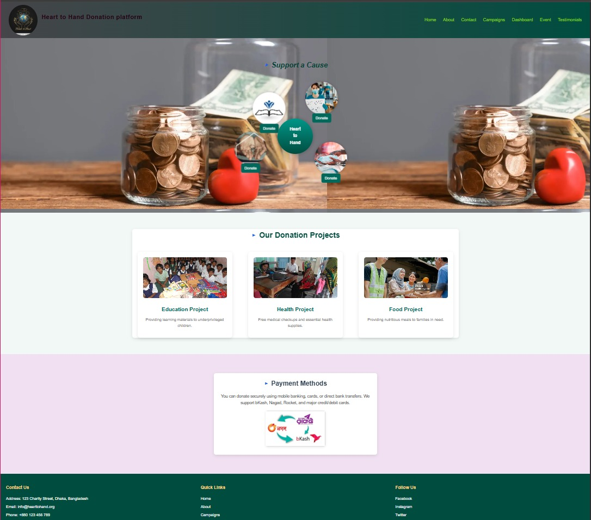
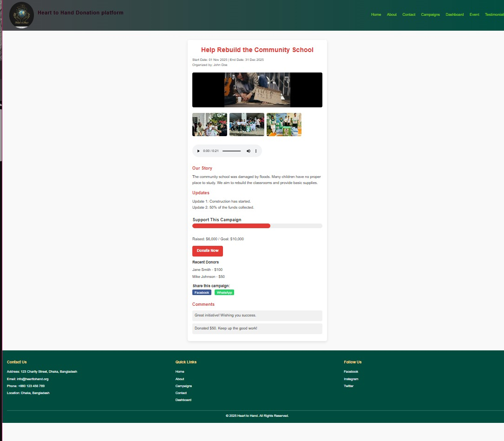
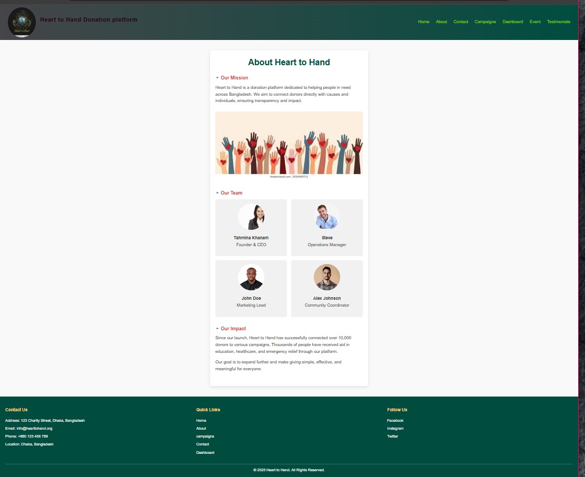

# 🤝 Heart to Hand — Donation Platform

A fully responsive, multi-page donation website that connects donors with meaningful causes across Bangladesh. This platform is built entirely using **Pure HTML5** and **Raw CSS3** (including custom CSS animations and embedded SVG data metrics), developed completely from scratch without relying on heavy frontend frameworks like Bootstrap or JavaScript libraries.


---

## 📌 Overview
**Heart to Hand** is a donation platform web application designed to bridge the gap between donors and communities in need across Bangladesh. The platform supports campaigns focused on Education, Healthcare, Food, and Shelter — enabling users to donate, track campaign progress, register for events, and engage with the community through testimonials and comments.

---

## ✨ Features

### 🏠 Homepage (`myBase.html`)
* **Animated CSS Orbit UI:** 4 donation categories (Education, Health, Food, Shelter) orbit a central brand logo using pure CSS Keyframes.
* **Donation Project Cards:** Clean layout cards with optimized grid images and descriptions.
* **Payment Method Section:** Visual layouts for local payment networks (bKash, Nagad, Rocket, Credit/Debit cards).



### 📢 Campaign Page (`myCampaign.html`)
* **Full Campaign Detail:** Structured template covering title, date range, and organizer info.
* **Image Gallery:** Embedded multi-photo grids (`schoolCampaign.jpeg`, `education_Project.jpg`).
* **Multimedia Integration:** Native HTML5 video and audio appeal layers (`flash-flood-river-193062.mp3`).
* **Donation Progress Bar:** Functional custom CSS progress bar showcasing milestone data (**Raised: $6,000 / Goal: $10,000**).
* **Community Features:** Recent donors list, comments feed, and social share triggers (Facebook, WhatsApp).


### 💳 Donate Now (`donatenow.html`)
* **Donation Form:** Custom styled input form capturing user details and amount (Minimum validation: **50 BDT**).
* **Dynamic Instructions:** Visual guidelines mapping out step-by-step payment flows based on method.

### 📊 Dashboard (`myDashboard.html`)
* **Campaigns Data Table:** Matrix listing project status badges (`Live` / `Upcoming` / `Completed`).
* **Progress Meters:** Status tracker bars mapping individual institutional progress.
* **SVG Bar Chart:** A native **Pure SVG Bar Chart** showing data breakdowns by categories.


### 📅 Event Registration (`myevent.html`)
* **Registration Form:** Data fields capturing name, email, phone, and participant counts.
* **Dropdown Selection:** Interactive options covering Education Support Camp, Health Check-up Day, Food Distribution, and Shelter Relief.

### 🔐 User Authentication Layouts
* **Registration & Sign Up:** Hand-coded login, account creation, and user identity profile flows.
* **Password Recovery:** Structure paths mapping Forgot Password and Reset Password layouts.

### 👥 About, Testimonials & Contact (`aboutus.html`, `Testimonials.html`, `contactme.html`)
* **Impact Framework:** Grid panels showcasing mission profiles, team cards, and impact stats (**10,000+ donors**).
* **Location Mapping:** Contact form integrated seamlessly with an embedded functional **Google Maps** block.

---

## 🛠️ Tech Stack & Highlights

* **Architecture:** 100% Hand-coded (❌ No Bootstrap, ❌ No Tailwind, ❌ No JavaScript)
* **Markup:** HTML5 (Semantic elements, form controls, tables, SVG vectors, audio/video layers)
* **Styling & Engine:** CSS3 (Flexbox spacing, linear gradients, multi-device adaptive media queries)
* **Animations:** CSS Keyframes for the orbital interface, smooth transitions, and hover scales
* **Typography:** Google Fonts (Poppins)
* **Integrations:** Embedded Google Maps API

---

## 📂 Project Structure

```text
📁 Mywebsite_Tahmina/
│
├── 📁 css/
│   └── myCss.css                  # Single shared core raw stylesheet
│
├── 📁 files/
│   ├── 📁 images/                 # 20+ verified visual assets
│   │   ├── logo.jpg               # Main corporate identity logo
│   │   ├── backgroundimg.webp     # Hero background image
│   │   ├── CEO_Image.jpeg         # Leadership team showcase asset
│   │   ├── Edubackground.webp     # Section graphical banner
│   │   ├── mission.jpeg           # Impact profile asset
│   │   ├── P1.jpeg                # Volunteer profile grid photo
│   │   ├── education.jpg / education_Project.jpg
│   │   ├── helth.jpg / helthproject.jpeg
│   │   ├── food.jpg / FoodProject.jpg
│   │   ├── Shelter.jpg / Shelter.webp
│   │   └── Donation.jpg
│   ├── 📁 audios/
│   │   └── flash-flood-river-193062.mp3   # Campaign audio appeal
│   └── 📁 videos/
│       └── 8077014-uhd_4096_2160_25fps.mp4  # Campaign HD presentation video
│
└── 📁 pages/
    ├── myBase.html                # Homepage with orbit animation
    ├── aboutus.html               # About the platform & team profiles
    ├── myCampaign.html            # Campaign detail with media segments
    ├── donatenow.html             # Donation/Payment form template
    ├── myDashboard.html           # Analytics grid & SVG chart layout
    ├── myevent.html               # Event registration framework
    ├── Testimonials.html          # Donor & beneficiary feedback quotes
    ├── contactme.html             # Contact info & Google Maps container
    ├── registration.html          # User signup layout
    ├── createAcc.html             # Account setup confirmation screen
    ├── forgetPass.html            # Password recovery terminal interface
    └── resetpass.html             # Secure key re-assignment screen
